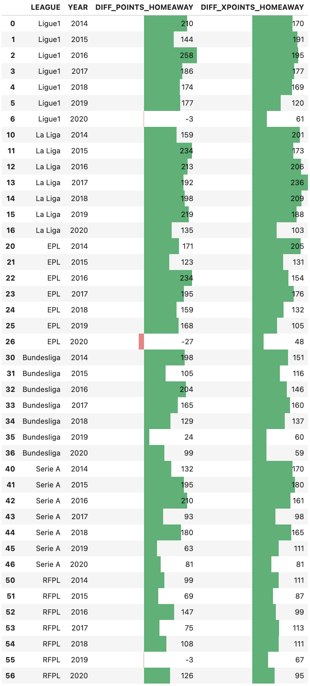

# Reproducibility and Replicability Project : COVID and Home Advantage in Football
Ezgi OZEL - Alp JAKOP  
5 INFO

# TODO
- high quality photos
- add photos for statistical analyses parts (reproduce)
- solve scipy version problem

## Introduction

This analysis focuses on exploring the concept of home advantage in football and how it was impacted during the COVID-19 pandemic. Home advantage has long been a significant topic in sports science, with research attributing it to factors such as crowd support, travel fatigue, and referee bias. The COVID-19 pandemic provided a unique natural experiment, as matches were played in empty stadiums during 2019–2021, removing the influence of crowds.

The original study on this topic was conducted by our professor, **Mathieu Acher**, and can be found here: https://blog.mathieuacher.com/FootballAnalysis-xG-COVIDHome/

By combining reproducibility with replication and introducing variability factors, this project not only validates the original findings but also extends their scope to new contexts. The results provide valuable insights into the dynamics of home advantage, offering a deeper understanding of how external factors like crowd absence can alter the competitive balance in football.

## How to Reproduce and Replicate

1. **Requirements**  
  - Docker installed on your machine.
  - Bash shell (Linux/MacOS, or Git Bash on Windows).
  - The environment is managed through Docker to ensure consistent results. The following Python libraries are used (requirements.txt):
    - `pandas`
    - `matplotlib`
    - `jupyter`
    - `nbconvert`
    - `scipy==1.6`
    - `numpy(>=1.16.5, <1.20)`

2. **Reproducing Results and Executing Replication**  
  - Run the `run_notebooks.sh` script to execute the entire workflow:  
    ```bash
    bash run_notebooks.sh
    ```
    The script will:  
    - Build the Docker image and set up the environment.  
    - Execute `Data-Extraction.ipynb`.  
    - Execute `Reproduce.ipynb`.  
    - Convert `Reproduce.ipynb` to HTML.  
    - Execute `Replicate.ipynb`.  
    - Convert `Replicate.ipynb` to HTML.  
    
    HTML outputs will be available in the `notebooks` directory.

  - Open `notebooks/Reproduce.ipynb` and `notebooks/Replicate.ipynb` to execute the analysis step-by-step. Don't forget to verify that the versions of the dependencies on your local machine match those specified in `requirments.txt` file.

## Reproducibility
    
### Encountered Issues and Improvements
While the results ultimately matched, we faced several challenges due to missing documentation in the original study and differences in our initial computational setup:

1. **Data Extraction Process:** The resource for the data was specified, but the methodology for extracting and processing the data was not detailed. This initially caused discrepancies in data representation during our reproduction attempt.
2. **Lack of Environmental Specifications:** The study did not specify the versions of software, libraries, or tools used. Differences in versions, particularly SciPy, resulted in variations in p-values and statistical test outputs in our early attempts. The original study employed Wilcoxon and Mann-Whitney U tests with `alternative='less'`, while our initial setup defaulted to `alternative='two-sided'`. This conflict led to doubled p-values and initially misaligned results.

**Adjustments to Match Methodology:** To address these issues, we contacted the original author, who provided clarification on the data extraction process and the computational environment. We subsequently downgraded both SciPy and Python versions to match their setup, allowing us to replicate their statistical configuration. This adjustment ensured comparability in p-value interpretation and consistency with the original methodology.

Despite these numerical differences, the key findings remained consistent: **home advantage significantly diminished during COVID-19 when matches were played without crowds**. This challenge underscored the importance of documenting software versions and methodological details in reproducing studies. It also illustrated the robustness of the original findings, as they held true even when tested with different software configurations.

### Is the Original Study Reproducible?

The original study is **reproducible**, as our reproduced analysis produced identical results once key methodological details were clarified. The study's findings regarding the significant reduction in home advantage during the COVID-19 pandemic were fully confirmed.

The original study analyzed the difference in points gained at home and away across multiple leagues and seasons, highlighting a largely positive home advantage for non-COVID seasons. Four key analyses were performed, which were successfully reproduced in this study with exact results:

**Home vs. Away Points:** Differences between points gained at home and away were assessed. The results consistently showed a significant positive home advantage for all leagues in non-COVID seasons.

<div align="center">
  
</div>


**Evolution of Mean Points per Match:** The mean points gained per match for home and away teams were plotted across seasons from 2014 to 2020, illustrating the steady trend of home advantage and its disruption during COVID seasons.

<div align="center">
  
</div>


**Comparison Across All Leagues and Seasons:** Wilcoxon Signed-Rank tests were applied to assess the differences between home and away matches for points, xPoints, and xG across all leagues and seasons. Effect sizes were calculated using Cohen’s d to quantify the magnitude of these differences. The results consistently demonstrated a significant home advantage in non-COVID seasons.

**Seasonal Comparison Within Each League:** Mann-Whitney U tests were conducted to evaluate differences between seasons for each league. These tests focused on actual results at home and xPoints at home, capturing how home performance varied across seasons and highlighting the impact of the COVID-19 pandemic on home advantage.

The reproduction successfully reproduced the results of the original study, confirming its findings. These consistent outcomes validate the robustness of the original analysis and demonstrate the reproducibility of its conclusions regarding the impact of the COVID-19 pandemic on home advantage in football.

## Replicability

### Variability Factors
- **List of Factors**:  
  | Variability Factor | Possible Values     | Relevance                                   |
  |--------------------|---------------------|--------------------------------------------|
  | **Statistical Tests for Assessing Differences Between Home and Away Matches** | [Wilcoxon, Paired t-Test] | Different statistical tests highlight diverse characteristics of the data, impacting p-values and interpretations. |
  | **Data Inclusion:** Post-COVID Data	| [2014–2020, 2014–2023] | Including post-COVID data (2020–2023) assesses whether home advantage returned to pre-COVID levels. |
  | **League Selection:** Champions League | 	[Domestic Leagues, Champions League] | Adding the Champions League introduces better teams, higher stakes, and a broader dataset, testing generalizability. |

- **Constraints Across Factors**:  
  - **Statistical Tests:** Tests like Wilcoxon and paired t-tests require balanced datasets with equal numbers of home and away matches.
  - **League and Match Context:** Results from one league may not directly translate to another due to differences in formats and competitive environments.

### Presentation and Analysis of Results 
#### Changing Statistical Tests for Assessing Differences Between Home and Away Matches
In the original study, the Wilcoxon Signed-Rank test was used because it is a non-parametric test, ideal for situations where data may not follow a normal distribution. For the use of p-values, they quantified the evidence against the null hypothesis (e.g., no difference between home and away performance) and small p-values (e.g., <0.05) indicated statistically significant differences, suggesting that observed results are unlikely due to random chance.

In our replication study, we opted to use the paired t-test instead of the Wilcoxon Signed-Rank test. The paired t-test is a parametric test that assumes data follows a normal distribution and is used to compare two related groups. This change was made to assess whether the choice of statistical test would alter the conclusions.

<div align="center">
  
</div>

Our results confirmed that the differences between home and away performances remained significant in the pre-COVID years under the paired t-test, supporting the findings of the original study. However, during during the COVID season, when matches were held without fans due to the COVID-19 pandemic, the paired t-test showed no statistically significant difference in performance between home and away matches.

This lack of significant difference during the COVID season reinforces the hypothesis that home advantage is influenced by external factors, such as crowd support. The results underline that changes in statistical methodology (shifting from non-parametric to parametric tests) did not fundamentally alter the conclusions but provided additional confidence in the robustness of the observed trends.

#### Adding Post-COVID Data (2021-2023)
In this replicability analysis, we aimed to assess the impact of the post-COVID seasons (2021 onward) as a potential variability factor in understanding home advantage in football. The COVID-19 pandemic created a unique natural experiment in sports, where matches were played in empty stadiums, effectively removing one of the critical elements of home advantage: *crowd support*. This provided a rare opportunity to isolate the influence of environmental and psychological factors on team performance.

However, with the return of fans to stadiums in subsequent seasons, an important question arises: **Did home-field advantage return to pre-COVID levels, or has the dynamic shifted permanently?** This variability factor—performance in post-COVID seasons—will allow us to test the robustness and generalizability of the original study's conclusions.

We started by comparing the difference between home and away performance across multiple leagues and seasons, focusing on two metrics:
1. **DIFF_POINTS_HOMEAWAY:** The difference in points gained at home versus away for each season and league.
2. **DIFF_XPOINTS_HOMEAWAY:** The difference in expected points (xPoints) gained at home versus away for each season and league.

<div align="center">
  
</div>

From this chart, we can see that home advantage diminished significantly during the COVID season, possibly due to the absence of crowds. While crowds have returned post-COVID, the full restoration of home advantage is uneven across leagues, with some (like the EPL) showing stronger recovery than others (like Ligue 1, Serie A, and Bundesliga). This variability highlights the long-term impact of the pandemic on football dynamics, suggesting a lasting shift in how home advantage operates in some leagues.

Following the original analysis, we decided to use charts to illustrate the evolution of home and away performance across the leagues over the seasons from 2014 to 2023. Each plot represents two key metrics:
1. **Results (Points Gained Per Match):** The actual mean points gained by teams in home (result) and away (result_away) matches.
2. **Expected Points (xPoints):** The model-predicted mean points based on performance data for home (xPoints) and away (xPointsAway) matches.

<div align="center">
  
</div>

Across all leagues, the absence of crowds during the COVID season significantly reduced or nullified home advantage. Home teams scored fewer points, while away teams improved, highlighting the importance of crowd support and environmental factors in football dynamics. Post-COVID, most leagues show a partial recovery in home advantage with the return of crowds, but only the English Premier League appears to have fully regained its pre-COVID dynamics. Other leagues, like Ligue 1, Bundesliga, and Serie A, show a lasting reduction in the home-field advantage, suggesting a new normal where the gap between home and away performances is narrower than before.

By performing **Wilcoxon Signed-Rank tests** and calculating **Cohen’s d** effect sizes, we aimed to quantify the differences between home and away performances both before, during, and after the pandemic. This analysis investigated:
1. **Statistical Significance:** Using Wilcoxon p-values to determine whether differences in metrics such as points (pts), expected points (xPoints), and expected goals (xG) between home and away teams are significant.
2. **Effect Sizes:** Using Cohen’s d to measure the magnitude of these differences and assess the practical impact of home advantage.

<div align="center">
  
</div>

The results confirm that COVID and the absence of crowds disrupted home advantage across all leagues. While there has been some recovery post-COVID, the extent varies:
- **EPL:** Near-complete recovery.
- **Bundesliga, Ligue 1, RFPL:** Partial or incomplete recovery, with lingering reductions in home advantage.
The combination of Wilcoxon p-values and Cohen’s d effect sizes provides robust evidence of these shifts, emphasizing the role of external factors like crowd support in shaping football outcomes.

#### Adding Champions League Data
For another variability factor, we decided to pull Champions League matches data from *stathead.com*. This dataset covers **pre-COVID seasons (2017–2019)**, the **COVID-impacted season (2019–2020)** with no fans, and **post-COVID seasons (2021–2023)** with varying levels of recovery in crowd attendance and team dynamics.

Analyzing the 2017–2023 Champions League seasons introduces a valuable variability factor by leveraging the unique features of this international competition. It allows us to:
1. Test the robustness of home/away dynamics across a wide range of teams, venues, and contexts.
2. Evaluate the impact of global events (like COVID) and high-pressure match contexts on the original findings.
3. Strengthen the conclusions of the replication by demonstrating whether the results generalize beyond domestic leagues to elite international football.

This dataset provides a rich testing ground for exploring variability while maintaining relevance to the original study.

We started again by comparing the difference between home and away performance across multiple seasons, focusing on two metrics:
1. **DIFF_POINTS_HOMEAWAY:** The difference in points gained at home versus away for each season and league.
2. **DIFF_XG_HOMEAWAY:** The difference in expected goals (xG) gained at home versus away for each season and league.

<div align="center">
  
</div>

We can see that even though the tournament features top teams from across Europe with varying tactical styles, squad depth, and historical dominance and different pressures and higher stakes than the national football competitions, home advantage diminished significantly during the COVID season (between 2019 and 2020). We can put forward the hypothesis that the reason for this is the absence of crowds. Home advantage is often considered more pronounced in international tournaments due to long-distance travel, unfamiliar environments, and crowd hostility.

We also decided to use charts to display the trends in mean points per match and mean expected goals (xG) for home and away teams in the Champions League from seasons 2017 to 2023.

<div align="center">
  
</div>

The graph clearly shows how the COVID-19 pandemic disrupted the traditional home advantage in the Champions League. Before the pandemic, the data consistently demonstrated a significant home advantage. Home teams not only gained more points per match but also generated higher expected goals (xG), proving to us again that playing on familiar surroundings with the support of passionate home fans provided a clear advantage. The COVID-19 pandemic, however, disrupted this dynamic. During the 2019–2020 season, matches were played in empty stadiums, stripping home teams of their usual psychological and environmental advantages. The absence of crowds led to a significant reduction in home advantage, as reflected in the narrowing gap between home and away points and xG. In the post-COVID period (2021–2023), the gradual return of fans has brought back some elements of home advantage. Home teams have shown an upward trend in performance metrics like points and xG, signaling a partial recovery. However, the levels have not yet returned to the pre-COVID norm in many cases. This lingering gap suggests that the dynamics of home advantage may have shifted, with teams and players adapting to the conditions of crowdless games during the pandemic.

### Does It Confirm the Original Study?
The results of this replication confirm the findings of the original study, demonstrating that the conclusions drawn about home advantage during the COVID-19 pandemic were well-founded and robust. By employing different statistical tests, including paired t-tests in addition to Wilcoxon Signed-Rank tests, we were able to validate the original conclusions with consistent results. This strengthened the reliability of the findings, showing that the statistical methods chosen did not affect the key outcome: that home advantage was significantly reduced during the COVID-19 seasons when matches were played without crowds.

Adding post-COVID data further reinforced the validity of the original study's conclusions. By including seasons from 2021 to 2023, we observed a gradual recovery of home advantage across most leagues. This recovery coincided with the return of fans to stadiums, underscoring the central role of crowd support in influencing home-field dynamics. While some leagues, such as the English Premier League, have almost fully regained pre-COVID levels of home advantage, others, like Ligue 1, Serie A, and the Bundesliga, still show lingering effects of the disruption. The difference between home and away results during the COVID period compared to the post-COVID era makes it abundantly clear that the absence of crowds was a pivotal factor in diminishing home advantage. This is a critical confirmation that the pandemic created a unique disruption, not just in the logistical elements of football, but in its fundamental dynamics.

Expanding the analysis to include the Champions League, a competition characterized by high-level teams, intense tactical battles, and greater competitive stakes, further validated the original study's conclusions. Even in this elite context, the effects of COVID-19 on home advantage were apparent. The data revealed that during the pandemic, the gap between home and away results narrowed significantly, just as it did in domestic leagues. This is especially striking given the unique pressures of international tournaments, such as long-distance travel, unfamiliar environments, and heightened stakes, all of which typically amplify the importance of home advantage. The fact that similar trends were observed in the Champions League confirms the universality of the disruption caused by the absence of fans, proving that this phenomenon was not limited to domestic competitions but extended across all levels of football.

These findings **confirm that the original author was correct in their conclusions about the impact of COVID-19 on home advantage**. The replication study has shown that the observed changes during the pandemic were not random anomalies but rather systematic shifts caused by the unique conditions of that period. By replicating and extending the analysis, we have further solidified the understanding that crowd presence is a cornerstone of home advantage, affecting not just the psychology of players and referees but also the broader dynamics of competitive football.

## Conclusion

In this project, we have explored the impact of the COVID-19 pandemic on home advantage in football, focusing on the reproducibility and replicability of the original study conducted by Mathieu Acher. Our findings confirm that home advantage was significantly altered during the pandemic when matches were played in empty stadiums. By replicating and extending the analysis with additional variability factors, we validated the original conclusions while providing a deeper understanding of how the absence of crowds affected competitive balance.

The reproducibility section of the study demonstrated that the original results could be reliably reproduced under consistent conditions using the provided datasets, software, and methodology. The replication aspect involved testing the model in various new contexts and highlighted the robustness of the conclusions even with different settings or match data. These results reinforce the hypothesis that crowd absence had a substantial effect on home advantage, leading to a reduced or even reversed effect in some cases.

However, there are several limitations to this study. First, the scope of our analysis was limited to specific leagues and countries, and results may differ in other regions or competitions. Additionally, external factors such as team performance changes due to the pandemic (e.g., different training conditions, player health, or travel restrictions) may have also influenced the outcomes but were not fully accounted for in the analysis. Moreover, the reliance on historical data introduces potential biases and the challenge of accurately modeling every variable that could affect match results.

Despite these limitations, this project offers valuable insights into how the dynamics of home advantage can shift when key external factors, such as crowd support, are removed.